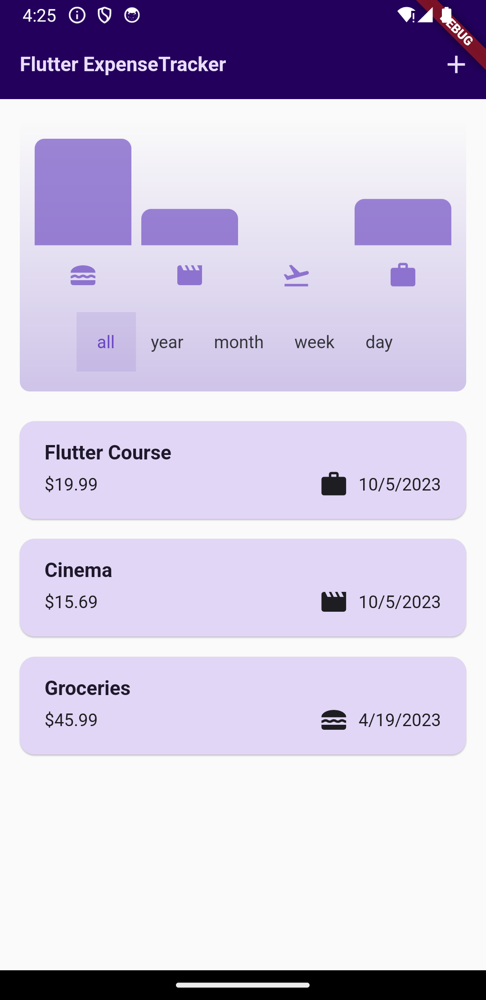
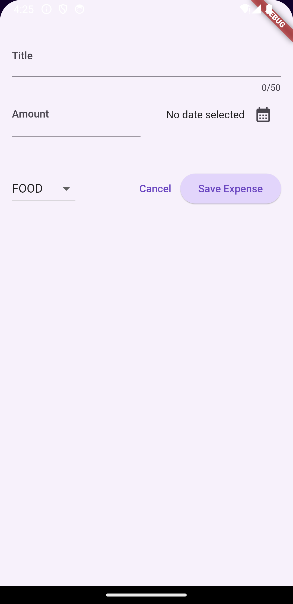

# Expense Tracker App

Expense Tracker is a simple Flutter application that helps you manage and track your expenses. It allows you to add new expenses, categorize them, view them in a list, and visualize your spending with a chart.

## Features

- Add new expenses with titles, amounts, dates, and categories.
- Categorize expenses into different categories like food, travel, leisure, and work.
- View a list of all your expenses, including details like title, amount, date, and category.
- Visualize your spending with a chart that shows expenses by category.
- Filter expenses by time period (all, 1 year, 1 month, 1 week, 1 day).
- Delete expenses and undo the deletion with a confirmation snackbar.

## Screenshots

## Getting Started

To get started with this project, follow these steps:

1. Clone the repository to your local machine:

`git clone https://github.com/Sebastiannilsen/expense_tracker.git`

2. Open the project in your preferred Flutter development environment (e.g., Android Studio, VS Code).

3. Install the required dependencies by running:

`flutter pub get`

4. Run the app on an emulator or physical device:

`flutter run`

5. Start managing your expenses!

## App Architecture

The Expense Tracker app follows a clean Flutter architecture, separating UI, data, and business logic. The core components of the app's architecture include:

- **Screens**: Contains the UI components and user interactions for different screens, such as the expense list, chart, and new expense entry.

- **Models**: Defines the data structures used in the app, including the `Expense` class for individual expenses and the `ExpenseBucket` class for grouping expenses by category.

- **Widgets**: Custom UI widgets used throughout the app, including chart bars and expense item cards.

- **Providers**: Manages app state and data, allowing widgets to access and modify data.

- **Services**: Handles data storage and retrieval, such as managing expenses and categories.

## User Stories and Specifications

- **User Story 1: Add New Expense**
  - As a user, I want to be able to add a new expense with a title, amount, date, and category.
  - Specifications: 
    - The user can enter a title for the expense (text input).
    - The user can enter the expense amount (numeric input).
    - The user can select a date for the expense (date picker).
    - The user can select a category for the expense (category dropdown).

- **User Story 2: View Expense List**
  - As a user, I want to view a list of all my expenses, including details like title, amount, date, and category.
  - Specifications:
    - The expense list displays each expense as a card with its title, amount, date, and category.
    - The list is scrollable to accommodate multiple expenses.
    - The user can delete expenses by swiping the expense card and undo the deletion with a confirmation snackbar.

- **User Story 3: Visualize Expenses with Chart**
  - As a user, I want to visualize my spending with a chart that shows expenses by category.
  - Specifications:
    - The chart displays bars representing expenses in different categories.
    - The user can filter expenses by time period (all, 1 year, 1 month, 1 week, 1 day) to update the chart.

- **User Story 4: Manage Expenses**
  - As a user, I want to be able to manage my expenses, including adding, deleting, and viewing them.

## File and Folder Structure

- **lib/**
  - **main.dart**: The entry point of the app.
  - **models/**
    - **expense.dart**: Defines the `Expense` class. 
  - **widgets/**
    - **expenses.dart**: Displays the main expenses screen.
    - **new_expense.dart**: Displays the screen for adding new expenses.
    - **chart/**
      - **chart_bar.dart**: Custom widget for chart bars.
      - **chart.dart**: Displays the chart screen.
    - **expenses_list/**
      - **expense_item.dart**: Custom widget for expense list items.
      - **expenses_list.dart**: Custom widget for the expense list.

## Dependencies

This project uses the following packages and dependencies:

- Flutter: [https://flutter.dev/](https://flutter.dev/)
- uuid: [https://pub.dev/packages/uuid](https://pub.dev/packages/uuid)
- intl: [https://pub.dev/packages/intl](https://pub.dev/packages/intl)
